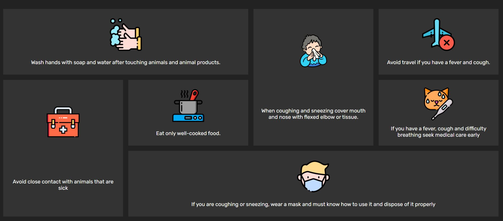

# Covid-Masonry-Layout
 This is a design of Masonry Grid Layout.  ## Table of contents  - [Overview](#overview)   - [The challenge](#the-challenge)   - [Screenshot](#screenshot)   - [Links](#links) - [My process](#my-process)   - [Built with](#built-with)   - [What I learned](#what-i-learned) - [Author](#author)  ## Overview  ### The challenge  Users should be able to:  - View the optimal animation on hovering your mouse to the card - See hover states for all interactive elements on the page  ### Screenshot  - Normal View - Hover View  ### Links  - Solution URL: [Github](https://github.com/zaidansari42/Covid-Masonry-Layout/) - Live Site URL: [Live Website](https://zaidansari42.github.io/Covid-Masonry-Layout/)  ## My process  ### Built with  - Semantic HTML5 markup - CSS custom properties - Flexbox - Grid  ### What I learned  I learned how to create a Grid Layout with only HTML &amp; CSS.  ```html  ```  ```css   ```  ## Author  - Website - [Zaid Ansari](https://github.com/zaidansari42/) - Twitter - [@zaidnasari42](https://www.twitter.com/zaidnasari42)
